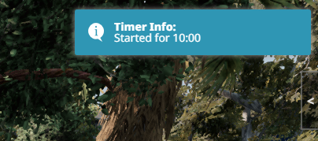
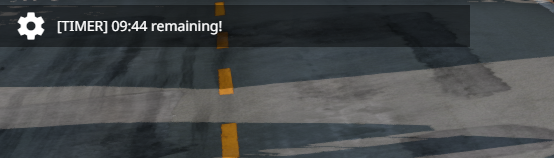
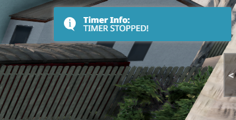

## BeamMP Timer

# Usage

You can type a chat command "/timer" with 1 or 2 arguments. For example:
- /timer 1 = Timer for one minute
- /timer 0 45 = Timer for 45 seconds
- /timer 2 10 = Timer for 2minutes and 10 seconds

After typing command you can see blue UI message in top right corner about starting timer and how long it will count.
\n

\n
At the same time in top left corner shows up how much time left.
\n

\n
You can override current timer by same command or type /timer stop to stop current timer.

When timer stopped by command or a countdown ends you will see blue message with text about it. 
\n
